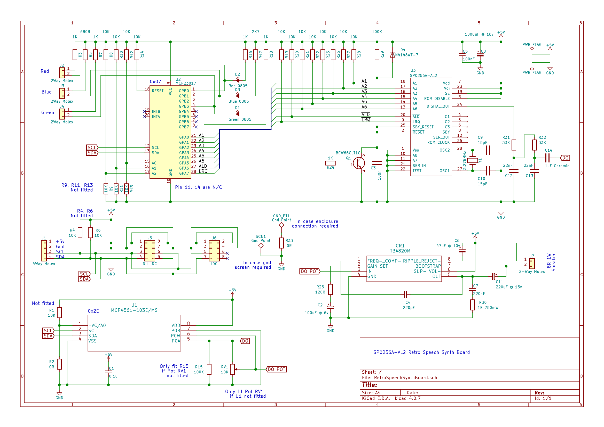
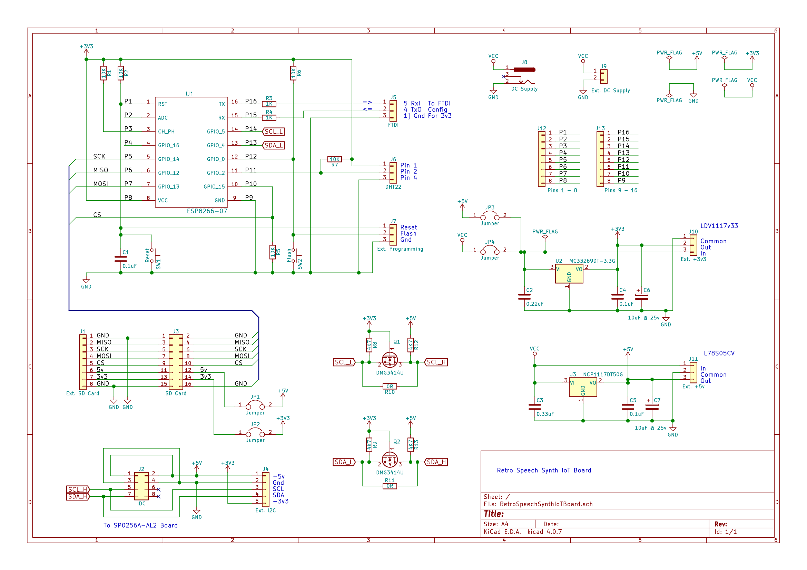

# IoT-Retro-Speech-Synthesis-SP0256-AL2

IoT Retro Speech Synthesis Using the ESP8266-07 and SP0256-AL2

### The IoT Speech Synthesis Device

### Full circuit diagrams

#### Retro Speech Synth Board

#### Speech Synth IoT Board

This repository holds the details on how to create an IoT Retro Speech Synth Device and is part of a series on IoT and home automation [here](https://www.instructables.com/id/Home-Automation-12/).

By Steve Quinn

Written to support the following Instructable;

https://www.instructables.com/id/Retro-Speech-Synthesis-Part-12-IoT-Home-Automation

### Directory contents

#### Tests

These are python based automated regression tests executed when there has been any code changes. The python script forms a test executive which uses an excel spreadsheet as it's input. Each work sheet is a single test made up of rows of executable actions.
When the test runs (by calling the doit.bat batch file) a time stamped log is displayed as execution proceeds. This log is also dumped to a text file.
Given time stamping is included, it is a useful tool to determine if there have been any dynamic changes in execution after a code change.

YouTube video testing in execution [here](https://www.youtube.com/watch?v=MwtR3u_uS0M&t=0s)

#### data

These files are to be copied to the SD card and are used by the system at start up to configure the device and serve up a web page if the device cannot connect to your home network for whatever reason. 
They are also used to present the user with documentation on how to use the device once a connection has been established with the mqtt broker by entering the following url; 'SPEECHSVR.local'

There are seven (main) text files named 'secvals.txt', 'calvals1.txt', 'calvals2.txt', 'index.htm', 'index1.htm', 'SP0256.htm', 'mqtt.htm'

##### Configuration files

index.htm : This is the source of the 'Speech Synth Configuration Home Page'

secvals.txt : contains six entries used by the IoT device to connect to your home network. You will need to add your own ID and P/W here.

calvals(1/2).txt : Contains simple calibration data for both the external(1) and internal(2) humidity and temperature sensors.

confvals.txt : Contains configurable entries to control the availability of and initial value of the onboard digital volume pot and auto announce 'system ready' status once connected to the broker etc.

##### Web Pages

Once connected to your network the Retro Speech Synth device offers a basic HTTP test interface and a set of on-line help pages detailing how to use the device and how to asemble words.
These files are located on the system SD card and can be customised by hand if necessary.

index1.htm : Provides a basic HTTP test interface with hyperlinks to SP0256.htm and mqtt.htm

SP0256.htm : Gives detailed information on how to contruct words using phonemes

mqtt.htm : This details how to use the Retro Speech Synthesiser over MQTT as an IoT device (full details of all topics supported by this IoT device are in the source code).

#### manufacture

This folder contains bills of materials for both Retro Speech Synth Board and the Speech Synth IoT Board.
It also contains zipped packages which can be used to have the boards manufactured (I used [JLCPCB](https://jlcpcb.com/) for mine).

#### docs

This contains the images on the front page of this repository.

